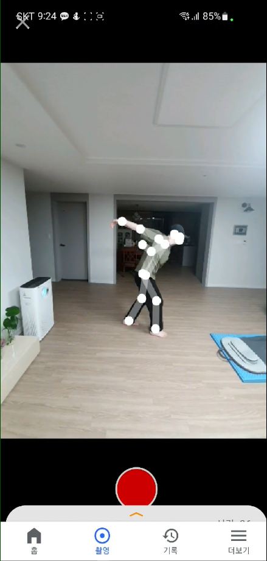
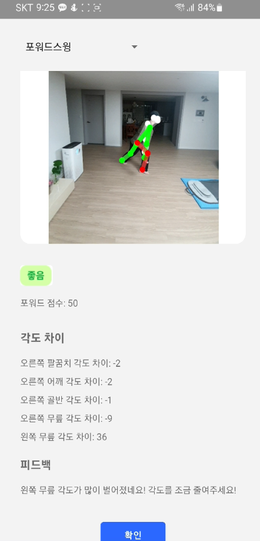

# 캡스톤 디자인1 KeepDev팀 '볼링쌤'

### 볼링쌤
본 프로젝트의 목표는 볼링의 모범 자세를 사용자에게 전달해 주어 좀 더 쉽게 볼링을 배울 수 있도록 도와주는 서비스 제공을 목표로 합니다.

#### 사용자의 자세 인식
 사용자의 자세를 모션 캡쳐 기능을 통하여 실시간으로 파악하고 AI가 신체 부위별로 올바른 자세와 비교하여 차이가 얼마나 나는지 화면에 보여줍니다.
 자세 모델링 학습 프로그램 (MoveNet): 주요 신체 관절의 위치를 예측하여 이미지 또는 비디오에서 사람의 포즈를 인식하기 위해 사용합니다. 사람의 주요 신체 관절 17개의 위치를 예측하여 좌표값을 얻었고 그중에서 한 사람의 포즈만 예측하면 됨으로 single pose estimation 알고리즘을 사용합니다.

#### 자세 평가 과정과 피드백
 사용자의 자세와 올바른 자세를 비교하여 평가합니다. 자세를 평가하는데 PCP와 관절의 각도를 계산하여 식별하는 2가지 방법이 있습니다. PCP 방법을 이용하여 관절의 좌표 반경을 이용한 자세 평가는 카메라 위치 및 각도, 방향 등이 매번 바뀌므로 인식되는 사람의 크기가 일정하지 않아 올바른 자세를 식별하기 적합하지 않다고 판단하여 관절의 각도 측정을 통한 자세 평가를 기준으로 진행했습니다.

#### 정확도 측정
 학습된 모델의 좌표(관절의 위치) 범위에 사용자의 자세가 포함되는지, 또는 관절의 각도가 올바른 각도인지에 따라 정확도를 나누어 점수를 계산합니다. 구간 별로 자세를 취할 때, 정확도가 0.9 ~ 1 이면 정확한 자세로 인식합니다. 정확도가 0.9 미만인 경우 보충해야 하는 자세로 인식합니다.

#### 카메라 위치 선정
 카메라를 사용자의 뒤쪽에 설치한다고 가정하면 팔과 다리가 겹쳐지는 부분은 인식이 잘 안되기 때문에 정확도가 떨어집니다. 그래서 카메라 위치를 사용자의 옆에서 찍기로 결정했습니다. 좌표가 아닌 각도로 정확도를 비교하기 때문에 카메라의 정중앙에 위치할 필요는 없고 사용자의 모든 신체 부위가 카메라 화면에 모두 나온다면 정확한 측정이 가능합니다. 

#### 로그인, 회원가입 기능
 계정이 만들어졌다면 이메일과 비밀번호를 입력해 로그인하고, 계정이 없다면 회원가입 또는 구글 계정을 통해 로그인합니다. FireBase DB를 이용하여 사용자의 데이터들을 저장하였고 기본적으로 users collection 데이터를 이용합니다. Authentication에서 유저 로그인 정보를 관리하는데 해당 부분에서 이메일을 가져와 userID에 저장하고, 생성된 고유 uid 값을 uid에 저장합니다. 그 외 볼 사이즈나 닉네임과 같은 정보는 유저 설정 화면에서 변경하거나 초기 회원가입 시 기입할 수 있습니다.

#### 내/외부 데이터베이스 (Firebase) 연결 및 활용
 기록 화면의 각 목록의 아이템들은 사용자 기기의 DCIM 폴더에 저장 되어 있는 영상의 이름과 6가지 자세에 대한 평균 점수를 나타냅니다. 각 아이템을 누를 경우 동영상과 함께 점수, 올바른 자세와의 각도차이, 피드백을 화면에 보여줍니다.

--------------
볼링 자세 연습을 카메라를 통해 합니다.

연습한 자세 피드백을 받습니다.
